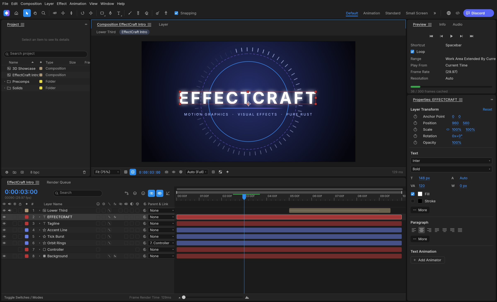
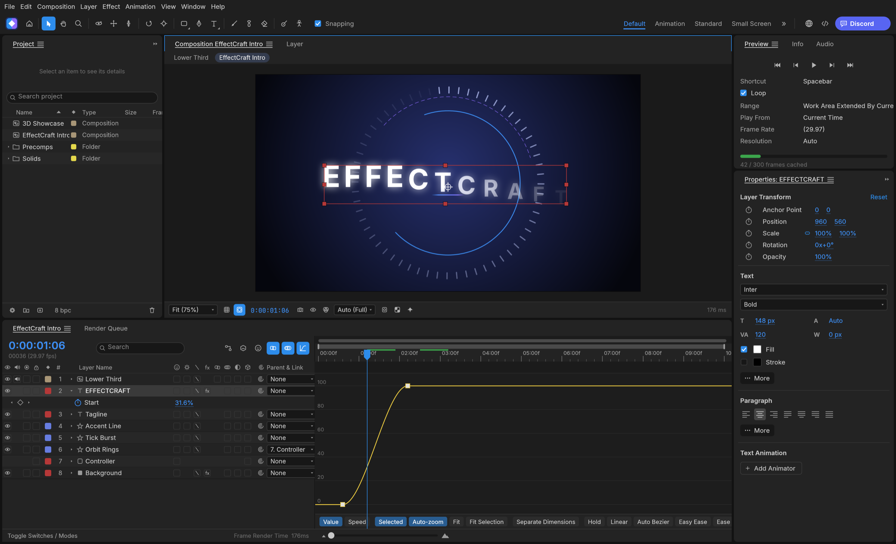
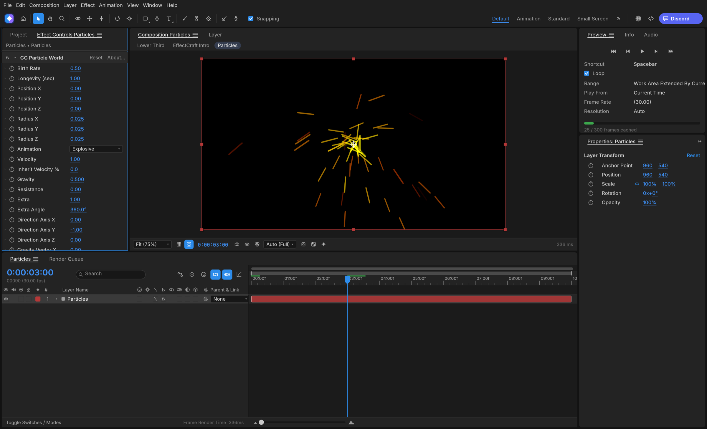
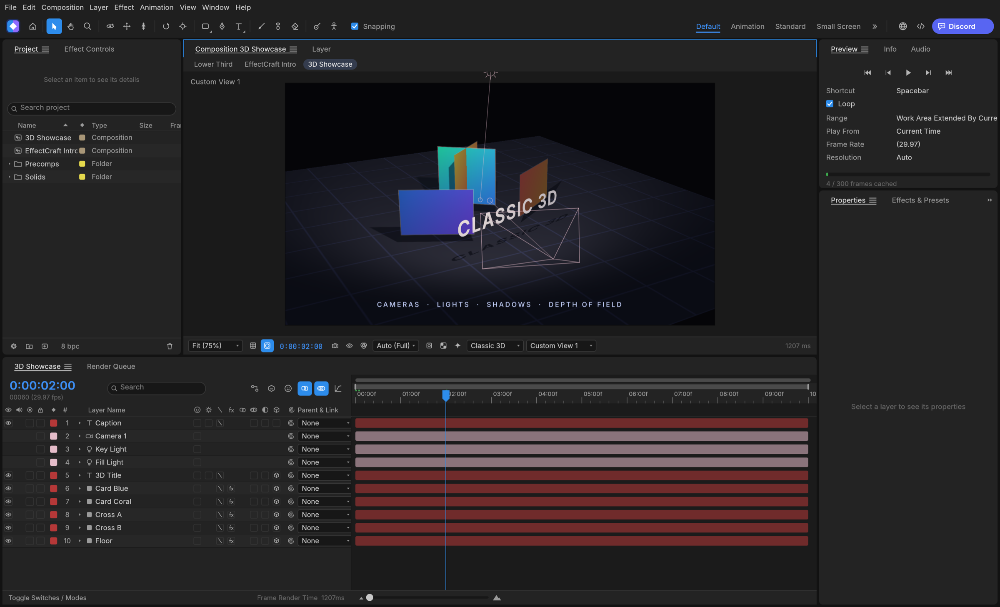
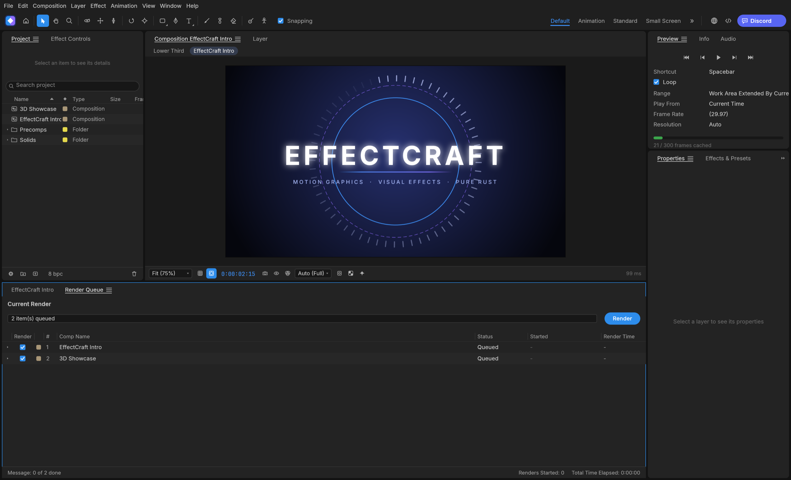

<p align="center">
  <a href="https://getartcraft.com/">
    <picture>
      <source media="(prefers-color-scheme: dark)" srcset="docs/brand/artcraft-logo-white.svg">
      
    </picture>
  </a>
</p>


<h1 align="center">EffectCraft</h1>

<p align="center">
  <b>Motion graphics and visual effects, in pure Rust.</b>
</p>

<p align="center">
  A free, open-source compositor in the spirit of After Effects: compositions, layers,
  keyframes, 259 effects, layer styles, expressions, 3D cameras and lights, and a render queue, native on macOS,
  Windows and Linux, and in the browser later on. Young, moving fast, and already usable.
</p>

<p align="center">
  
  
  
</p>

<p align="center">
  <a href="https://discord.gg/artcraft"></a>
</p>

<p align="center">
  <a href="https://getartcraft.com/apps/effectcraft"><b>EffectCraft on getartcraft.com</b></a> ·
  <a href="https://getartcraft.com/">ArtCraft</a> ·
  <a href="https://getartcraft.com/apps">All Crafting Apps</a>
</p>

<br>

<p align="center">
  
</p>

> [!NOTE]
> **ArtCraft is a community of artists from all walks of life.** Digital, generative, music,
> games &mdash; if you make things, you're one of us. **[Come say hi on Discord](https://discord.gg/artcraft).**

<p align="center">
  <a href="#what-effectcraft-is">What it is</a> ·
  <a href="#animate">Animate</a> ·
  <a href="#effects">Effects</a> ·
  <a href="#3d">3D</a> ·
  <a href="#export">Export</a> ·
  <a href="#built-for-agents">Agents</a> ·
  <a href="#get-started">Get started</a> ·
  <a href="#where-it-stands">Status</a> ·
  <a href="#how-its-made">How it's made</a> ·
  <a href="#the-crafting-apps">The Crafting Apps</a> ·
  <a href="#license-and-credits">License</a>
</p>

## What EffectCraft is

EffectCraft is for animated titles, motion graphics and compositing work: the kind of thing
people reach for After Effects to do. You build a composition out of layers (solids, shapes,
text, footage, other compositions), animate their properties with keyframes, stack effects on
them and render the result.

The aim is to feel familiar to anyone who has used After Effects, with the same panels (Project,
Composition, Timeline, Effect Controls, Effects & Presets) and the same keyframe behaviour, and
then to go further in a few places where it matters to us:

- **Lottie import and export built in**, so animations can go straight to the web and apps
  without a plugin.
- **A project file you can read.** Projects are versioned JSON (`.ecproj`), so they diff cleanly
  in version control.
- **Everything is scriptable.** Every menu item, timeline drag and property edit goes through one
  command registry, so the same actions are reachable from a command line, a JSON control
  channel and an MCP server for agents.
- **No FFmpeg.** Video and audio decoding and encoding come from FilmCraft's own pure-Rust
  codecs.

## Animate

The panels, menus and shortcuts follow After Effects, so your muscle memory carries over:
Project, Composition, Timeline, Effect Controls, Properties, Effects & Presets, Character,
Paragraph, Align, Info, Preview, Audio and the Render Queue, docked the way you expect.

- **Layers of every kind:** solids, shapes, text, footage, nested compositions, nulls,
  adjustment layers, cameras and lights; parenting, track mattes, all 38 blend modes, motion blur.
- **Keyframes that behave the same:** linear, Bezier, hold, auto and continuous Bezier, roving
  keys, Easy Ease (F9), Keyframe Velocity and Interpolation dialogs, copy and paste at the current
  time, and a **Graph Editor** with value and speed graphs and draggable handles.
- **Time:** time remapping, time stretch, time-reverse, freeze frame, work area, markers, exact
  frame-accurate timing at every frame rate including 29.97 drop-frame.
- **Shapes and masks:** shape layers with trim paths, repeaters, round corners, offset, zig zag,
  twist, wiggle, merge paths and gradient strokes; masks drawn with the pen tool, with modes,
  feather, expansion and vertex editing in the viewer.
- **Text:** point and paragraph text with real shaping, the Character and Paragraph panels, and
  text animators with range selectors.
- **Expressions:** JavaScript with the After Effects object model (`wiggle`, `loopOut`,
  `thisComp.layer("…")`, vector maths on arrays), an inline editor and the pick-whip.

<p align="center">
  
</p>

## Effects

259 effects across After Effects' categories, each with its parameter names, order and
defaults: blur and sharpen, channel, color correction (Curves, Levels, Hue/Saturation, Lumetri
Color…), distort (Warp, Bulge, Turbulent Displace, CC Power Pin…), generate (Fractal Noise,
Gradient Ramp, Stroke, Write-on, Audio Spectrum…), keying, matte, noise and grain, perspective,
**simulation** (CC Particle World, CC Rainfall, Shatter, Card Dance, Caustics, Wave World…),
stylize (Glow, CC Glass…), **time** (Echo, Posterize Time, Timewarp, Time Displacement…),
**audio** (Reverb, Parametric EQ, Delay, Stereo Mixer…), text, transitions, utility and expression
controls. All nine **Layer Styles** (Drop Shadow, Inner/Outer Glow, Bevel and Emboss, Satin,
overlays, Stroke) with Global Light. Preview plays audio in sync, with meters and waveforms.

<p align="center">
  
</p>

## 3D

Classic 3D the way After Effects does it: 3D layers with orientation and material options,
one- and two-node **cameras** with depth of field, **lights** (parallel, spot, point, ambient)
with soft ray-traced shadows, layers that intersect correctly, orbit, pan and dolly camera
tools, and Front, Top, Left and Custom views.

<p align="center">
  
</p>

## Export

A Render Queue like After Effects', with Render Settings and Output Modules: **H.264** MP4 and
**ProRes** MOV (Proxy to 4444 XQ with alpha) with audio, PNG, JPEG, TIFF and 32-bit EXR
sequences, and animated GIF. The same queue runs from the command line. Every encoder is
FilmCraft's pure-Rust code; there is no FFmpeg inside.

**Lottie** goes both ways: File ▸ Export ▸ Lottie JSON… writes a composition (precomps, shape,
solid, image, text and null layers, eased and spatial keyframes, masks, track mattes, blend
modes, time remapping, optionally expressions) as `.json` or `.lottie`, and lists anything Lottie
cannot express; File ▸ Import ▸ Lottie… opens one as a new composition.

<p align="center">
  
</p>

## Built for agents

Everything you can do from a menu is a command with an id, and agents can reach every one of
them:

- **MCP server:** `effectcraft-cli mcp` speaks the Model Context Protocol over stdio, headless
  or bridged to the running app (`--bridge 9877`). Tools cover commands, the project and property
  tree, keyframes and rendered frames. This repository ships a ready [`.mcp.json`](.mcp.json).
- **Command line:** one-shot calls with JSON output, for example
  `effectcraft-cli set Main '#1' transform/position '[100,360]' --time 0 main.ecproj --save`
  or `effectcraft-cli render --comp Main --out main.mp4`, or
  `effectcraft-cli exec file.exportLottie '{"comp":"Main","path":"main.json"}' main.ecproj`.
- **Control channel:** `effectcraft --control 9877` accepts JSON lines to run commands, inspect
  and click any widget by its automation id, and take screenshots.

See [docs/agents.md](docs/agents.md) and [docs/control-protocol.md](docs/control-protocol.md).

## Get started

You need [Rust](https://rustup.rs/) 1.95 or newer.

```sh
git clone https://github.com/storytold/effectcraft
cd effectcraft
cargo run --release -p effectcraft          # the app, with the demo project open
cargo run --release -p effectcraft-cli -- render --out intro.mp4    # render the demo headless
cargo xtask web --serve 8765                # the browser build on http://127.0.0.1:8765/ (docs/web.md)
```

To work on it: `cargo test --workspace`, and `cargo xtask ci` before every commit (format, lints,
tests, layering, asset attribution and the WebAssembly build). See [CONTRIBUTING.md](CONTRIBUTING.md),
[docs/architecture.md](docs/architecture.md) and [docs/testing.md](docs/testing.md).

## Where it stands

EffectCraft is young. The core of After Effects is in place and gets deeper every week: what is
done and what comes next is in the [ROADMAP](ROADMAP.md). Not there yet: Roto Brush, Warp
Stabilizer and the 3D camera tracker, Advanced 3D, on-canvas text editing and GPU compositing. The web build
([docs/web.md](docs/web.md)) runs the full app in the browser, single-threaded for now. Projects
are saved as `.ecproj`, readable versioned JSON; After Effects `.aep` files cannot be opened.

## How it's made

- **Engine first.** A stack of small crates with strict layering. The interface (egui) sits on
  top and nothing underneath depends on it.
- **Clean room.** We work from After Effects' public documentation and how it behaves, never
  from Adobe's files, icons, presets or code. No code is copied from GPL projects. The full rules
  are in [AGENTS.md](AGENTS.md).
- **Private by default.** No telemetry, and no network access unless you ask for it.
- **One family.** EffectCraft shares its time model and text engine design with FilmCraft, and
  gets its video and audio codecs from it.

## The Crafting Apps

EffectCraft is one of the **Crafting Apps**: free, open-source creative tools from the
[ArtCraft](https://getartcraft.com/) team, each written from scratch in Rust and each able to
stand on its own.

| App | What it's for | Code | Learn more |
|---|---|---|---|
|  **PhotoCraft** | Image editing: layers, masks, type and real PSD files | [GitHub](https://github.com/storytold/photocraft) | [getartcraft.com](https://getartcraft.com/apps/photocraft) |
|  **VectorCraft** | Vector illustration (formerly DrawCraft) | [GitHub](https://github.com/storytold/vectorcraft) | [getartcraft.com](https://getartcraft.com/apps/drawcraft) |
|  **FilmCraft** | Video editing, color and sound | [GitHub](https://github.com/storytold/filmcraft) | [getartcraft.com](https://getartcraft.com/apps/filmcraft) |
|  **LightCraft** | Photo library and raw development | [GitHub](https://github.com/storytold/lightcraft) | [getartcraft.com](https://getartcraft.com/apps/lightcraft) |
|  **PrintCraft** | Reading, organizing and protecting PDFs | [GitHub](https://github.com/storytold/printcraft) | [getartcraft.com](https://getartcraft.com/apps/printcraft) |
|  **EffectCraft** | **Motion graphics and visual effects · you are here** | [GitHub](https://github.com/storytold/effectcraft) | [getartcraft.com](https://getartcraft.com/apps/effectcraft) |
|  **DesignCraft** | Page layout and publishing | [GitHub](https://github.com/storytold/designcraft) | [getartcraft.com](https://getartcraft.com/apps/designcraft) |

And [**ArtCraft**](https://getartcraft.com/) itself, our AI image and video studio for artists who want real control.

<br>

<p align="center">
  <a href="https://discord.gg/artcraft"></a>
</p>

<h3 align="center">Come make things with us</h3>

<p align="center">
  Our Discord is where artists of every kind hang out: people who paint, shoot, draw, cut film,
  set type, and people still figuring out what they like to make. Share what you're working on,
  ask for help, tell us what's broken, or tell us what you wish these tools could do.
  Whatever your medium and however long you've been at it, you're welcome here.
</p>

<p align="center">
  <a href="https://discord.gg/artcraft"><b>discord.gg/artcraft</b></a> ·
  <a href="https://getartcraft.com/">getartcraft.com</a> ·
  <a href="https://getartcraft.com/apps">The Crafting Apps</a> ·
  <a href="https://getartcraft.com/apps/effectcraft">EffectCraft</a>
</p>

## License and credits

EffectCraft is dual-licensed under [MIT](LICENSE-MIT) or [Apache 2.0](LICENSE-APACHE), at your
option. Bundled fonts and other non-code assets are listed with their authors and licenses in
[ATTRIBUTION.md](ATTRIBUTION.md).

After Effects is a trademark of Adobe. EffectCraft is an independent project and is not
affiliated with or endorsed by Adobe.

<p align="center">
  <a href="https://getartcraft.com/"></a><br>
  <sub>Made by the <a href="https://getartcraft.com/">ArtCraft</a> team and community.</sub>
</p>
